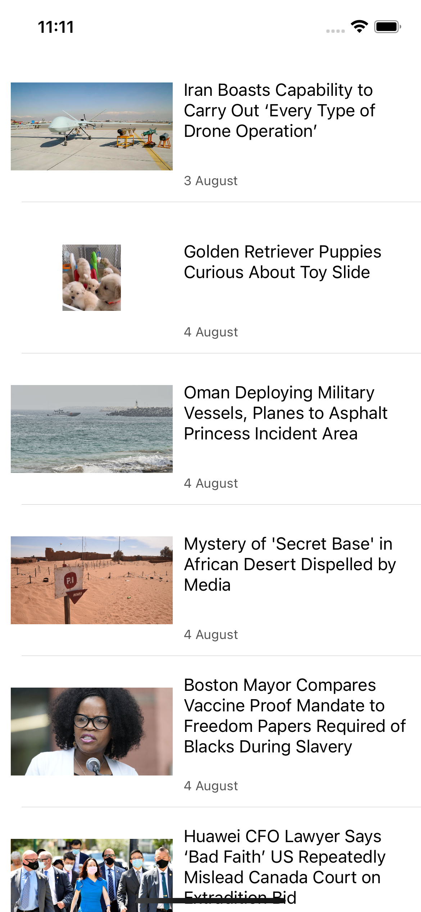

# Today - News app for iOS
This iOS app displays a list of news, fetched from mediastack API. 

## Running This Project
 - Clone this project and open with XCode.
 - Sign up to medisatack.com and get an API key.
 - Replace `API_KEY` variable in `NewsManager.swift` file.

## Features
 - Infinite Scroll
 - Display news details by clicking on the news item

## Screenshots

  
  

